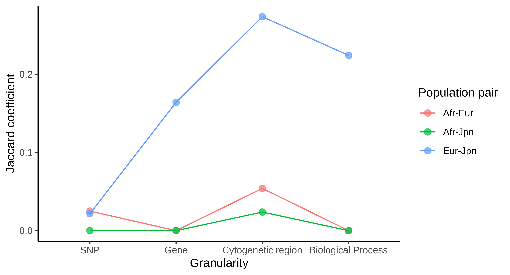

# Biological Granularity Affects the Replicability of GWAS Across Populations in Type 2 Diabetes

#### Replicability across populations of genome-wide significant SNPs, genes, cytogenetic regions, and enriched biological processes across European, Japanese, and African descent populations

## Authors

Undina Gisladottir (@undinag)
Michael Zietz (@zietzm)

## Abstract

Type 2 diabetes mellitus (T2D) is a chronic metabolic disorder affecting over 30 million individuals in the United States. The pathogenesis of T2D depends on a number of factors and is known to have a genetic component. While a number of studies have been conducted and have found SNPs with genome-wide significance for T2D, such studies are often limited by their inclusion of limited population diversity. Recent meta-analyses of GWA studies in the Japanese (2019) and Sub-Saharan African (2019) populations, and a more distant (2012) large-scale GWAS meta-analysis in European populations afford an opportunity to compare the replicability of genome-wide significant SNPs and enriched biological processes between populations. We hypothesized that enriched biological processes are more replicable across populations than genome-wide significant SNPs. In this study we evaluate the replicability of significant SNPs across the Japanese, European, and African populations included in these studies, and we perform gene set over-representation analyses on the SNPs from each study to evaluate the replicability of over-represented biological processes. The GWAS in African-descent individuals did not have sufficient significant associations to show replicability (only 2 significant loci reported). We found that the large sample sizes in the Japanese and European studies afforded enough significant loci to show that decreasing biological granularity increases the shared disease associations.

## Results

## Data sources

### SNP resources

* Japanese T2DM meta-analysis (Suzuki, et al.)
    * GWAS Catalog:  https://www.ebi.ac.uk/gwas/studies/GCST007847
    * Paper: https://www.nature.com/articles/s41588-018-0332-4
* European T2DM meta-analysis  (Morris, et al.)
    * GWAS Catalog: https://www.ebi.ac.uk/gwas/studies/GCST005047
    * Paper: https://www.ncbi.nlm.nih.gov/pmc/articles/PMC3442244/
* African TDDM study (Chen, et al.)
    * GWAS Catalog: https://www.ebi.ac.uk/gwas/studies/GCST008114
    * Paper: https://www.ncbi.nlm.nih.gov/pmc/articles/PMC6560001/

### Gene set resources

To investigate enriched gene sets and their replicability between these two studies, we used gene sets for biological processes (BP: “GO biological process”, 7350 gene sets). 

## Methods

### Data collection

Data from both studies was acquired through the EBI GWAS Catalog (https://www.ebi.ac.uk/gwas/). The studies used in this analysis were GCST007847, GCST005047 and GCST008114. Included for each study were SNPs, mapped genes, and p-values for each SNP.

### Over-representation analysis

We used [PANTHER](http://pantherdb.org/) to compute over-represented gene sets. While we focused on GO Biological Processes, we also conducted over-representation analysis for GO Molecular Functions, GO Cellular Components, and Reactome pathways.

### Replicability

To compare the replicability of genome-wide significant SNPs and enriched biological processes, we created two separate contingency tables. The first table represents the SNPs that are associated with T2D at genome-wide significance. The second table represents biological process gene sets significantly enriched among T2D-associated genes (mapped from associated SNPs). Both of these correspond to a three-way comparison between GWA studies.
